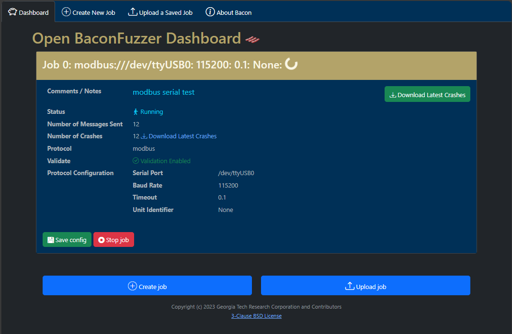
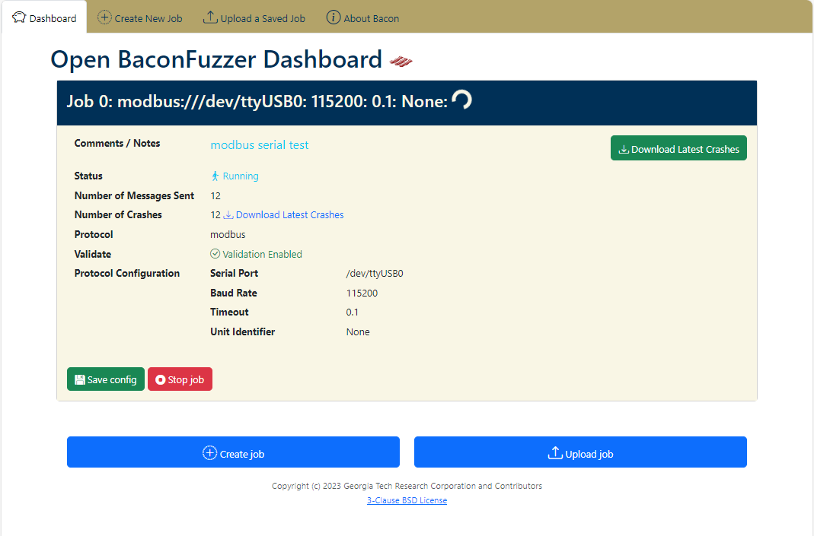

# Open Bacon Fuzzer

The Open Bacon Fuzzer is a lightweight fuzzing tool to support testing other software or devices for flaws. It allows for easy extension to support new protocols and message formats, provides basic crash logging, and is __primarily built to be quick and easy to setup__.

The end goal of this project is not to replace feature-rich fuzzers and frameworks, but rather to develop a streamlined base tool for rapid enablement of fuzzing and testing to complement the feature-rich capabilities and tools.

The Bacon Fuzzer is a middle ground between full-featured fuzzing, and super-targeted fuzzing – something that allows targeted message and data structure fuzzing for software and hardware devices.  Something that can rapidly be extended for new message formats, without developing a whole new tool or set of tools.

There are no harnesses to write, no ultra-complicated docker container deployments with multiple databases and balancers.  Bacon Fuzzer is just a simple fuzzer for rapidly getting to throwing bits at a device or piece of software.

Bacon Fuzzer allows for rapid message and format extension, has a light/dark mode UI (based on client system settings), and provides basic logging functionality.




## Intended Use-Cases and Audience

Bacon is intended to enable researchers and engineers to rapidly start testing software, hardware, or firmware.  It's minimal in features, but a good way to start smoke testing devices, or test out some inklings of ideas for areas to investigate further.

The UI and design is made to foster rapid collaboration with students, educators, researchers and engineers.

## Getting Started

Since Bacon is meant to be a quick effort fuzzer, getting started is straight forward.

### Install

In the directory containing the bacon fuzzer code:

1) Activate a virtual environment; for example:
  
    ```sh
    python3 -m venv venv
    source venv/bin/activate
    ```

2) Install bacon fuzzer

    ```sh
    pip install -e .
    ```

### Packaging

Client-side requirements have been statically included so you don't need internet once fuzzing commences.  Bootstrap, icons, css, js, and other dependencies have been statically included in source to facilitate ready use in off-line environments after initial install.

### Run

Run `baconfuzz` to launch the UI, and point your favorite (or least unfavorite) browser to [http://localhost:5000](http://localhost:5000). The web UI will guide you through the rest.

### Troubleshooting

If you encounter a permission denied error for the serial port, ensure your user has permission to access the serial port, such as:

```sh
sudo gpasswd --add ${USER} dialout
```

Crashes are stored under the `crashes` directory, which is organized as `crashes/<protocol>/<interface>/<fuzzer thread ident>/` (each fuzzer thread gets its own directory).  The web UI state is currently non-persistent -- once you kill the process, it loses state of past jobs.  However, the __crash logs and configurations are retained on disk indefinitely__ under their respective folders.  While running, the web UI provides an easy way to download the latest crashes for each job that has generated crashes.

## Contributing

Our goal is to increase support for messages and formats.  Under the hood, Bacon uses Scapy to generate messages.  The intent was to ensure the barrier to entry for normal researchers and engineers would be minimal.  Feel free to submit your changes for incorporation.

## Roadmap

The Bacon Fuzzer aims to be a quick install and easy setup tool for fuzzing.  Full stop.  If you want a lot of features this might not be the tool for you (there are plenty of capable tools in that category).

Our long-term goal is to add new message and protocol support (contributions are welcome).  We also intend to add a RESTFUL API in the future to make automating things a bit easier.

Since this is intended to be a quick effort fuzzer, we do not anticipate adding much in terms of databases for backing the storage.  However, we may consider SQLite as long as it does not complicate setup and deployment.

## License

This work is licensed under the [BSD 3-Clause "New" or "Revised" License](LICENSE)

## Credits

Please refer to the [credits](CREDITS.md) file for credits.

Copyright (c) 2024 Georgia Tech Applied Research Corporation and Contributors
